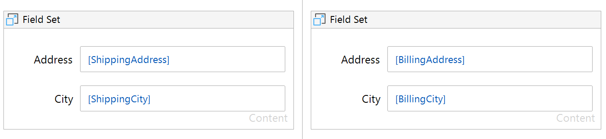

## Field Set

**Warning: This prototype is for demonstration purposes only. And is not an official Mendix product with support.**

Make your application more accessible by grouping inputs into sets.

## Use Case Sample
Help screen readers understand context. You can group `Shipping address` and `Billing Address`, so the labeled inputs `Street`, and `City` are understood correctly.

## Usage
 - Place the widget on the page
 - Optional provide a `Caption`
 - Group the relevant inputs inside the widget

